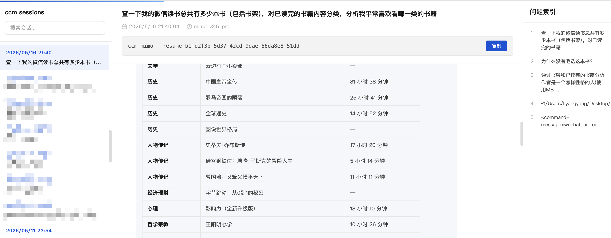

# ccm - Claude Code Model Manager

[](https://www.npmjs.com/package/@leeandrew94/ccm)
[](https://www.npmjs.com/package/@leeandrew94/ccm)
[](https://www.npmjs.com/package/@leeandrew94/ccm)

[English](README.md) | [中文](#中文)

## 中文

在不同终端窗口用不同 AI 模型运行 Claude Code，一行命令切换，互不干扰。

ccm（Claude Code Model Manager）是一个命令行工具，让你在不同终端窗口同时使用不同的 AI 模型运行 Claude Code。每个终端独立绑定模型、API 地址和密钥，不修改全局配置，终端之间完全隔离。通过命令行按名称切换模型、查看运行实例、管理配置。

## 环境要求

- **Node.js** >= 18.0.0
- **Claude Code** 已全局安装：`npm i -g @anthropic-ai/claude-code`

## 安装

```bash
npm i -g @leeandrew94/ccm
```

## 卸载

```bash
npm uninstall -g @leeandrew94/ccm

# （可选）删除配置和运行数据
rm -rf ~/.ccm
```

## 快速开始

```bash
# 交互式初始化（推荐）
ccm init

# 启动
ccm mimo

# 新开终端，换个模型
ccm init
ccm deepseek

# 查看谁在跑
ccm ps
```

## 命令

| 命令 | 说明 |
|---|---|
| `ccm init` | 交互式初始化向导 |
| `ccm <name>` | 加载 profile 并启动 claude |
| `ccm add <name>` | 新增 profile |
| `ccm edit <name>` | 修改 profile |
| `ccm rm <name>` | 删除 profile |
| `ccm list` | 列出所有 profile |
| `ccm config <name>` | 查看 profile 配置（不启动） |
| `ccm ps` | 查看运行中的实例 |
| `ccm kill <name>` | 停止指定实例 |
| `ccm kill --all` | 停止所有实例 |
| `ccm check` | 检查 claude 是否安装 |
| `ccm test [name]` | 测试 API 连接（不指定则测试全部） |
| `ccm balance [name]` | 查询模型余额（不指定则查询全部） |
| `ccm sessions` | 浏览会话历史（终端交互式列表） |
| `ccm sessions --web` | 在浏览器中打开会话查看器 |
| `ccm sessions --restore [id]` | 从回收站恢复已删除的会话 |
| `ccm sessions --purge` | 永久清空回收站 |

## 会话管理

浏览、搜索、恢复你的 Claude Code 对话历史。

<p align="center">
  
</p>

```bash
# 终端交互式列表 — 方向键导航
ccm sessions

# 在浏览器中查看完整对话
ccm sessions --web

# 恢复最近一次删除的会话
ccm sessions --restore

# 恢复指定会话
ccm sessions --restore <sessionId>

# 永久清空回收站
ccm sessions --purge
```

**终端列表操作：**
| 按键 | 功能 |
|---|---|
| `↑↓` | 上下选择 |
| `Enter` | 在浏览器中打开 |
| `d` | 删除会话（移入回收站） |
| `D` | 清空全部会话（移入回收站） |
| `←→` | 上一页/下一页 |
| `q` | 退出 |

## Shell 补全

```bash
# zsh — 添加到 ~/.zshrc
source <(ccm completions zsh)

# bash — 添加到 ~/.bashrc
source <(ccm completions bash)
```

## 配置

Profile 配置文件 `~/.ccm/profiles.json`（通过 `ccm add` / `ccm edit` 管理）：

```json
{
  "mimo": {
    "ANTHROPIC_BASE_URL": "https://api.example.com",
    "ANTHROPIC_AUTH_TOKEN": "sk-xxx",
    "ANTHROPIC_MODEL": "model-name",
    "ANTHROPIC_DEFAULT_HAIKU_MODEL": "model-name",
    "ANTHROPIC_DEFAULT_SONNET_MODEL": "model-name",
    "ANTHROPIC_DEFAULT_OPUS_MODEL": "model-name"
  }
}
```

| 变量 | 必填 | 说明 |
|---|---|---|
| `ANTHROPIC_BASE_URL` | 是 | API 端点 |
| `ANTHROPIC_AUTH_TOKEN` | 是 | API 密钥 |
| `ANTHROPIC_MODEL` | 是 | 模型名称 |
| `ANTHROPIC_DEFAULT_HAIKU_MODEL` | 否 | Haiku 映射 |
| `ANTHROPIC_DEFAULT_SONNET_MODEL` | 否 | Sonnet 映射 |
| `ANTHROPIC_DEFAULT_OPUS_MODEL` | 否 | Opus 映射 |

## Star History

[](https://www.star-history.com/?type=date&repos=leeandrew94%2Fccm-cli)

## License

MIT
